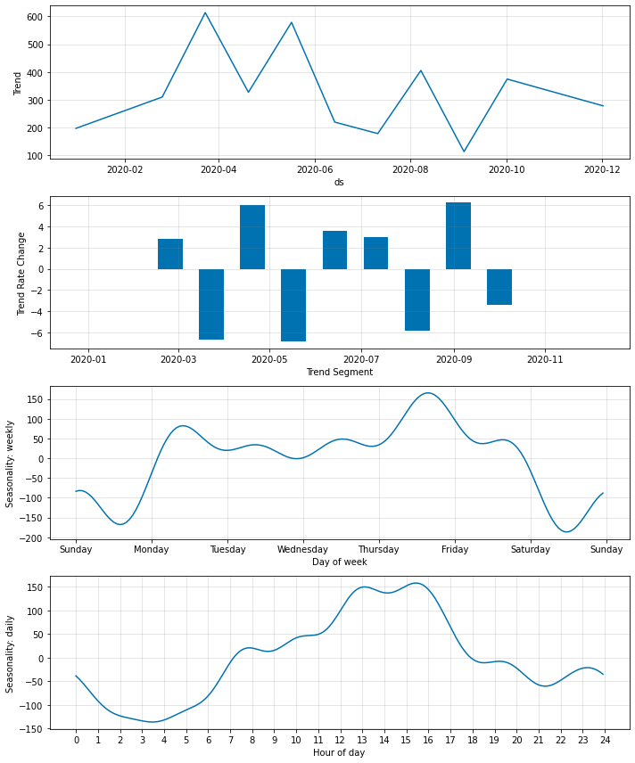
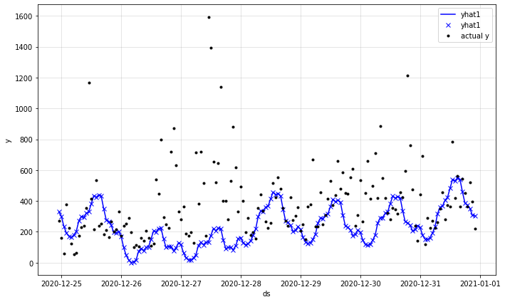

# Coin-Prophet

## Content

In this project I will explain how to use the [neuralprophet library](https://neuralprophet.com/html/index.html). It is intended to be a learning experience for myself, and anyone else who wants to take a look at neuralprophet.

## Goal

I would like to see what the seasonality is of the BTC trading volume.

## Dataset

In this project we use historical btc data which can be found on kaggle.

## Result

